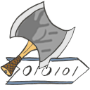

# HackaGames - An Hackable Games' Engine



### 🔵 The Team Blue

- Development of the Q-learning AI:
  * **Pierre Calon** - ([Github](https://github.com/PierreCalon))
    - Q-Learning Lead Developer
  * **Noah Châtelain** - ([Github](https://github.com/Nooaah))
    - Secondary Q-Learning Developer
    - Git Master
- Development of the Monte-Carlo and optimization:
  * **Tom Maillard** - ([Github](https://github.com/wipcamael))
    - Monte-Carlo Lead Developer
  * **Marvin Bonnet** - ([Github](https://github.com/AastroLePetitRobot))
    - Secondary Monte-Carlo Developer

## License

**HackaGame** is distributed under the [MIT license](./LICENCE.md).
This API comme with absolutly no guarantee.

## Installation

**HackaGames** is natively developed on and for Linux systems.
Commands are given regarding Ubuntu-like distribution.
However, **HackaGames** is packaged in several levels where the level one is only relaing to `python3` language.
This way level one will supported what ever our favorit operating system is.

### Level one (python)

Level one consist in making the **hakapy** `python3` module working.
The network protocol of **HackaGames** relies on `zmq` library and process-bar are implemented via `tqdm`
So first get those dependancies for instance via `pip`.

```sh
pip3 install zmq tqdm
```

## In this repository

Directories:

- *bin* : scripts for project management.
- *.git* : git directory (version manager).
- *doc* : some documentation of the project.
- *hackalib* : Librairy and tools like interfaces in different programing language to help connect a game.
- *hackapy* : Python version of the librairy and tools.
- *gameRisky** : Files essential for the proper functioning of the **Risky** game
- *resources* : some resources, images of **HackaGames** project.

Root Files:

- *README.md* : Your servitor.
- *LICENCE.md* : The Applied MIT license.

### Going further

See the documentation [table of contents](./doc/toc.md)

### Contributors

- Permanent contributor:
  * **Guillaume LOZENGUEZ** - [guillaume.lozenguez@imt-nord-europe.fr](mailto:guillaume.lozenguez@imt-nord-europe.fr)